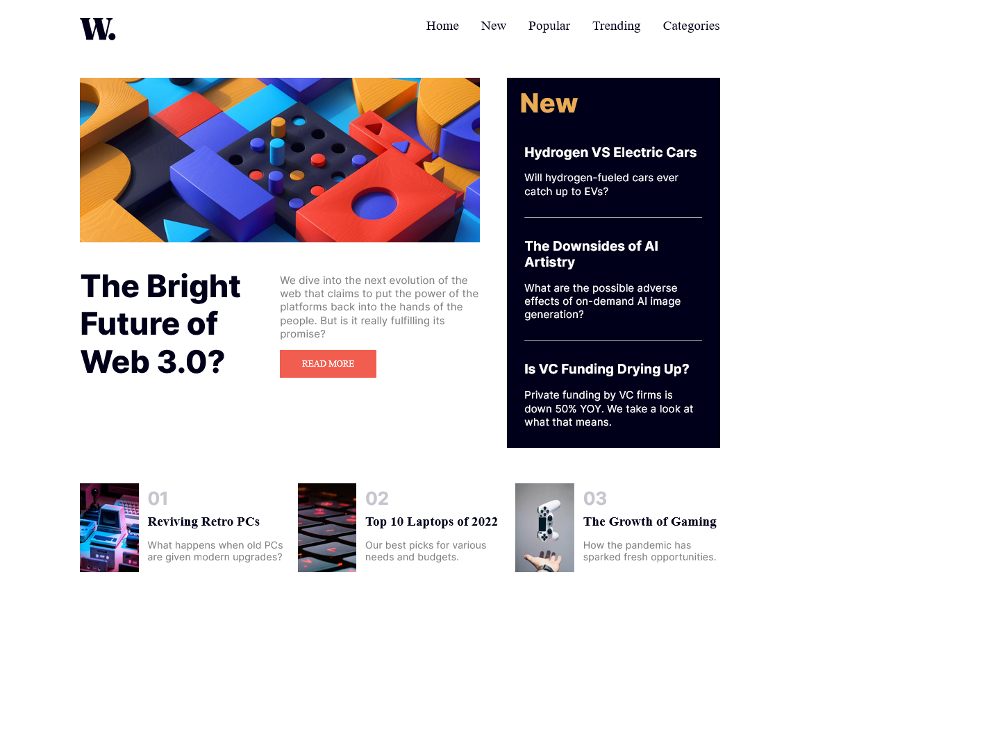

# Frontend Mentor - News homepage solution

This is a solution to the [News homepage challenge on Frontend Mentor](https://www.frontendmentor.io/challenges/news-homepage-H6SWTa1MFl)

## Table of contents

-   [Overview](#overview)
    -   [The challenge](#the-challenge)
    -   [Screenshot](#screenshot)
    -   [Links](#links)
-   [My process](#my-process)
    -   [Built with](#built-with)
    -   [What I learned](#what-i-learned)
    -   [Continued development](#continued-development)
    -   [Useful resources](#useful-resources)
-   [Author](#author)
-   [Acknowledgments](#acknowledgments)

## Overview

### The challenge

Users can:

-   View the optimal layout for the interface depending on their device's screen size
-   See hover and focus states for all interactive elements on the page
-   Toggle the mobile menu

### Screenshot



### Links

-   Solution URL: [Add solution URL here](https://your-solution-url.com)
-   Live Site URL: [Add live site URL here](https://your-live-site-url.com)

## My process

### Built with

-   Semantic HTML5 markup
-   Flexbox
-   CSS Grid
-   Mobile-first workflow

### What I learned

```css
.nav {
    transform: translateX(300px);
    transition: transform 1s ease-out, visibility 1s;
}
```

### Continued development

I would like to continue learning about CSS transitions, transforms and grid-areas

### Useful resources

-   [Stack Overflow Question on Navigation Bar Transitions](https://stackoverflow.com/questions/65742729/navigation-bar-transitions) - This question on Stack Overflow by [Micheal](https://stackoverflow.com/users/15008832/michael) answered by [bmdev](https://stackoverflow.com/users/14825873/bmdev) helped me implement my navigation bar transitions
-   [Easily Structure your Layout with CSS Grid's 'grid-template-areas'](https://youtu.be/qTGbWfEEnKI) - This video by [DesignCourse](https://www.youtube.com/@DesignCourse) on YouTube helped me understand what 'grid-areas' are and how to use them. Without the knowledge of this, I would just have used multiple flex-containers
-   [ChatGPT](https://openai.com/blog/chatgpt/) - This chatbot created by OpenAI is more than just a chatbot. It can debug code like a pro. During the project, when I had any issue, the first thing I did was ask this thing about the issue. Even though it is not completely accurate, it certainly is useful.

## Author

-   Discord - [@KaustubhMaladkar](https://discord.com/users/879677662795280445)
-   Frontend Mentor - [@KaustubhMaladkar](https://www.frontendmentor.io/profile/KaustubhMaladkar)
